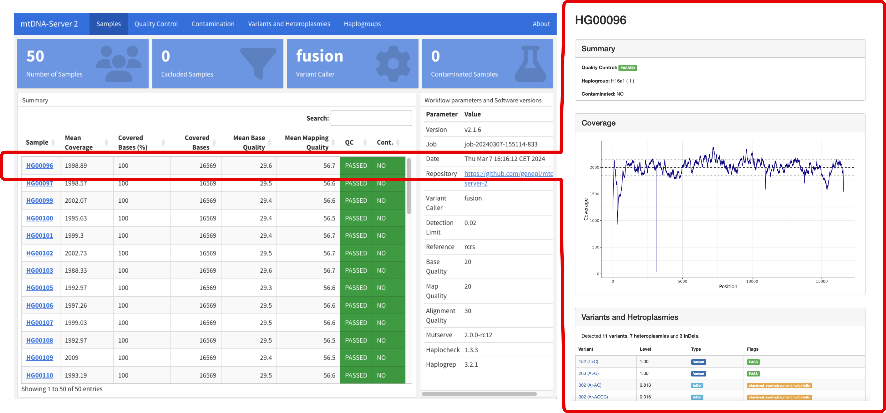

# mtDNA-Server 2

[](https://github.com/genepi/mtdna-server-2/actions/workflows/run-tests.yml)
[](https://github.com/askimed/nf-test)

mtDNA-Server 2 is a Nextflow DSL2 pipeline to accurately detect heteroplasmic and homoplasmic variants in mitochondrial (mtDNA) genomes. 

It supports different variant callers and is able to call insertions, deletions (INDELs) and single nucleotide variants (SNVs). Furthmore it includes several modules for (a) quality control and input validation (b) haplogroup classification and contamination detection, (c) minimal VAF estimation based on the coverage to minimize false positives and (d) an interactive analytics dashboard. 



mtDNA-Server 2 is available as a graphical web-service or a Nextflow pipeline for local execution. 

## Web Service

mtDNA-Server 2 is hosted as a **free** service on our [mitoverse](https://mitoverse.i-med.ac.at/) platform.

### Documentation

Documentation can be accessed [here](https://mitoverse.readthedocs.io/mtdna-server/mtdna-server/). 


We want to steadily improve mtDNA-Server 2. If your files are not working, please create a issue or contact [[Sebastian](mailto:sebastian.schoenherr@i-med.ac.at)] directly. 


### Version History
Release [v2.1.10](releases/tag/v2.1.10) - Improved mutect2 support: create missing RG tags, write inidividual reference sequence on the fly, support complex ref tags.

## Publication
Weissensteiner H*, Forer L*, Kronenberg F, Schönherr S. [mtDNA-Server 2: advancing mitochondrial DNA analysis through highly parallelized data processing and interactive analytics](https://doi.org/10.1093/nar/gkae296). Nucleic Acids Res. 2024 May 6:gkae296. doi: 10.1093/nar/gkae296. Epub ahead of print. PMID: 38709886.

## Local Execution
To run mtDNA-Server 2 locally, please execute the following steps. 

### Quick Start

1. Install [Nextflow](https://www.nextflow.io/docs/latest/getstarted.html#installation) (>=22.10.4)

2. Run the pipeline on our test dataset and select either Docker, Singluarity or Slurm. 
```
nextflow run genepi/mtdna-server-2 -r v2.1.10 -profile test,<docker,singularity,slurm>
```
### Run Pipeline on own data
To run mtDNA-Server 2 on your own data, create a [config file](tests/test_mitohpc_fusion.config) and run the following command:
```
nextflow run genepi/mtdna-server-2 -r v2.1.10 -c <your-config-file> -profile docker
```

### Development
```
git clone https://github.com/genepi/mtdna-server-2
cd mtdna-server-2
docker build -t genepi/mtdna-server-2 . # don't ignore the dot
nextflow run main.nf -profile test,development
```

### Documentation
The following parameters can be set in the configuration file. 
| Parameter            | Default Value        | Comment        |
|----------------------|--------------|----------------|
| project              | null         | Project name (required)   |
| files                | null         | Input BAM files (required) |
| mode                 | fusion       | Mode of operation (mutserve,mutect2,fusion) |
| detection_limit      | 0.02         | Detection limit for heteroplasmic sites |
| coverage_estimation  | on           | Coverage estimation enabled |
| subsampling          | off          | Subsampling on/off |
| subsampling_coverage | 2000         | Subsampling coverage |
| mapQ                 | 20           | Mapping quality threshold |
| baseQ                | 20           | Base quality threshold |
| alignQ               | 30           | Alignment quality threshold |
| output               | null         | Specific Output folder   |


## Contact

This software was developed at the [Institute of Genetic Epidemiology](https://genepi.i-med.ac.at/), [Medical University of Innsbruck](https://i-med.ac.at/)

 [Sebastian Schoenherr](mailto:sebastian.schoenherr@i-med.ac.at) ([@seppinho](https://twitter.com/seppinho))

 [Hansi Weissensteiner](mailto:hansi.weissensteiner@i-med.ac.at) ([@whansi](https://twitter.com/whansi))

 [Lukas Forer](mailto:lukas.forer@i-med.ac.at) ([@lukfor](https://twitter.com/lukfor))

## License

MIT Licensed.
